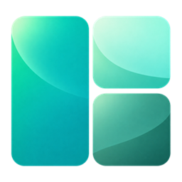
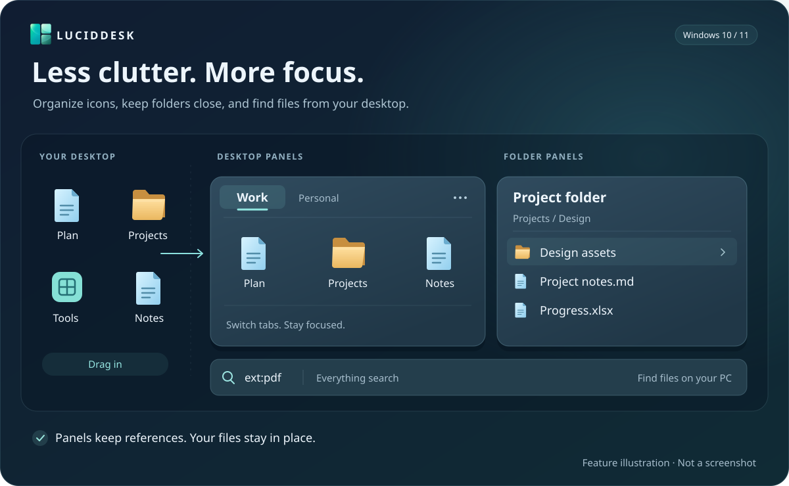
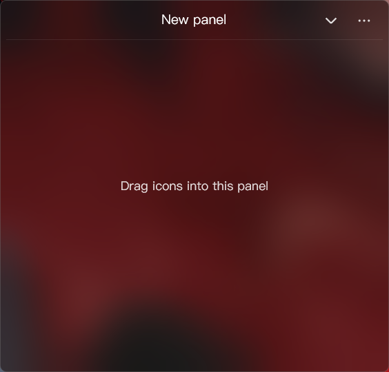
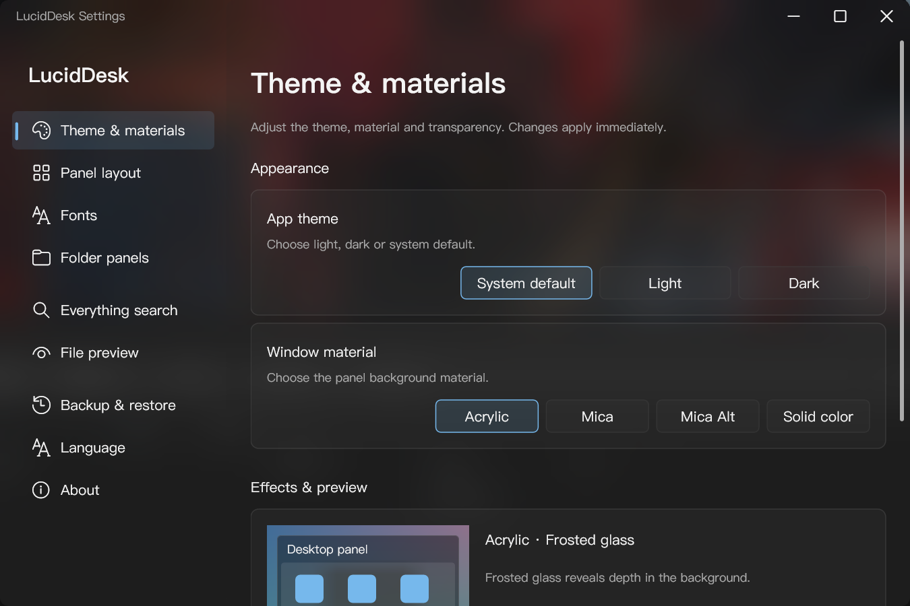
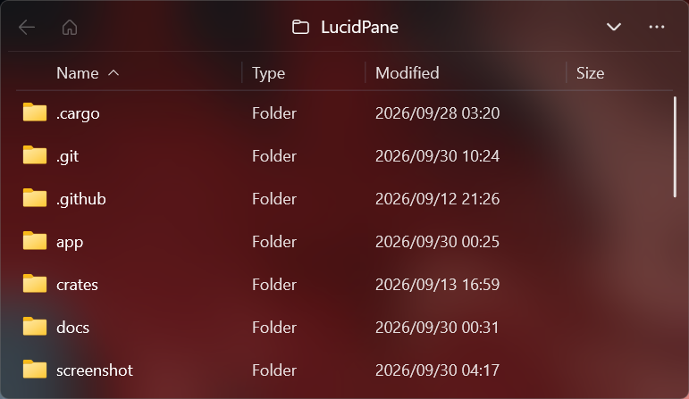
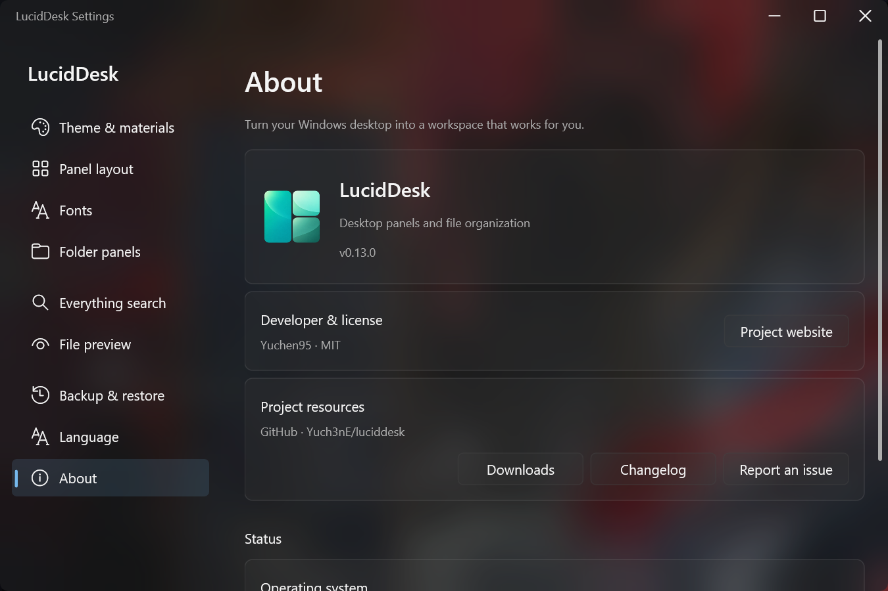

<div align="center">



# LucidDesk

[简体中文](README.md) · English

**Turn your Windows desktop into a workspace that works for you.**

Desktop panels · Folder panels · Everything search · Spacebar preview

[](LICENSE)
[](https://github.com/Yuch3nE/luciddesk/actions/workflows/build.yml)
[](CHANGELOG.en.md)
[](#compatibility)
[](docs/portable.md)

[⬇️ Download](https://github.com/Yuch3nE/luciddesk/releases) · [📸 Screenshots](#screenshots) · [🚀 Get started](#getting-started) · [📋 Changelog](CHANGELOG.en.md) · [🤝 Contribute](#contributing)

Organize desktop icons into panels, browse your favorite folders, and find files with Everything. Built with Rust for Windows, LucidDesk keeps your everyday files within reach.



<sub>Feature illustration · See actual screenshots below.</sub>

</div>

<a id="screenshots"></a>

## 📸 Screenshots

| Desktop panel | Theme & materials |
| :---: | :---: |
| <a href="screenshot/en/pane.png"></a> | <a href="screenshot/en/setting.png"></a> |
| Drag in icons to organize your desktop | Customize the theme and background |
| **Folder panel** | **About & status** |
| <a href="screenshot/en/folder.png"></a> | <a href="screenshot/en/about.png"></a> |
| Browse folders with type, modified date and size columns | View the version, project links and runtime status |

Click a screenshot to view the original. These show dark Acrylic; the appearance varies with your wallpaper and system settings. Mica materials require Windows 11.

<a id="features"></a>

## ✨ Features

| Feature | What you can do |
| --- | --- |
| Desktop panels | Organize files, folders and shortcuts without moving the original files |
| Panel tabs | Switch between panels, reorder tabs, merge them or detach them into separate windows |
| Folder panels | Browse directories, sort by name, type, date or size, and follow file changes automatically |
| File search | Find local files through Everything and open files or their locations |
| File preview | Press Space to preview selected files with PowerToys Peek or QuickLook |
| Fonts & languages | Search fonts suited to the current language and switch between seven interface languages without restarting |
| Backup & restore | Save and restore settings and layouts; automatic backups skip unchanged content |

Panels can move, resize, collapse, auto-hide, snap to edges, lock, or stay on top. Customize fonts, rounded corners, colors and background materials. Folder and search panels remain independent of panel tabs.

**Desktop panels do not move your files.** Dragging icons into a panel changes how they are organized on the desktop. Drag them back to remove them from the panel; closing a panel does not delete the original files. File menu commands such as delete, rename and cut, along with dropping or pasting into folder panels, operate on real files.

<a id="getting-started"></a>

## 🚀 Getting started

### Choose a package

Download from [GitHub Releases](https://github.com/Yuch3nE/luciddesk/releases). The installer is recommended for everyday use. All three packages have the same features.

| Package | File name | Default settings location | Best suited for |
| --- | --- | --- | --- |
| Installer | `windows-x64-setup.exe` | `%LOCALAPPDATA%\LucidDesk` | Setup wizard, Start menu and uninstall entry |
| Standard ZIP (non-portable) | `.zip`, without `portable` | `%LOCALAPPDATA%\LucidDesk` | Running without installation, with separate settings |
| Portable | Contains `windows-x64-portable` | The `data` folder beside the executable | Carrying settings with the app folder |

See the [installer](docs/installer.md), [standard ZIP](docs/package.md) or [portable](docs/portable.md) guide (Chinese). If no release is available, [build from source](#build-from-source).

### Launch and organize

**Installer:** choose `windows-x64-setup.exe` for a wizard with current-user or all-users installation. MSI can also be built from source; see the [installer guide](docs/installer.md).

**ZIP packages:**

1. Exit any running copy and extract the entire ZIP to a writable folder.
2. Run `luciddesk.exe`. Keep `luciddesk_explorer.dll` beside it; portable mode also requires `portable`. Do not run the app inside the ZIP.
3. Drag desktop icons into a panel. Use the tray menu to create panels or folder panels and open Settings.

Click the tray icon to show panels. Its menu also provides creation, search, refresh, configuration folder and exit actions.

### Enable search and preview

Search and preview are **disabled by default** and require separately installed software.

| Feature | Setup |
| --- | --- |
| File search | Install and run Everything, then enable the search panel in **Settings → Everything search** |
| Spacebar preview | Install PowerToys Peek or QuickLook, then select and enable it in **Settings → File preview** |

These tools are not bundled with LucidDesk. See the [user guide](docs/usage.md) (Chinese) for more controls and shortcuts.

An optional **Show all panels** global shortcut is available in **Settings → Panel layout**. It is off by default, with `Ctrl + Shift + D` as the preset. It performs the same action as **Show panels** in the tray and preserves each panel’s always-on-top setting.

<a id="upgrading-and-backups"></a>

## 🔄 Upgrading and backups

Use **Settings → About → Check for updates**, then **Open update page** to download the appropriate package from GitHub Releases.

| Package | Upgrade |
| --- | --- |
| Installer | Run the new installer; it reuses the install folder and can close the running app after confirmation |
| Standard ZIP | Exit the app and replace all program files; keep the separate settings folder |
| Portable | Exit the app and replace program files; preserve `data` and `portable` |

Keep the EXE and DLL from the same build together. Uninstall keeps user settings by default. Uncheck **Keep user settings** to remove the current account's default settings, layouts and backups. See the [installer guide](docs/installer.md) (Chinese).

Upgrades may continue using an existing `LucidDesk` data directory. To switch from standard to portable mode, export and restore your configuration.

Use **Settings → Backup & restore** to export or restore your configuration. Backups contain settings and layouts, not the original files referenced by panels. Moving a portable folder does not move those original files.

<a id="languages"></a>

## 🌐 Languages

The interface supports 简体中文, 繁體中文, English, 日本語, 한국어, Deutsch and Русский. It follows the Windows display language by default and falls back to English for unsupported languages. Choose a language in **Settings → Language**; it applies immediately.

Language changes update open windows in place while preserving panels, item selection and scroll positions. Font search text is retained, and candidates are filtered for the new language in the background.

Translations are embedded in the executable. Saved panel names and file names are unchanged. Native Windows Shell menus follow the system language. Translation contributions and corrections are welcome.

<a id="compatibility"></a>

## 🖥️ Compatibility

| Environment | Support |
| --- | --- |
| Windows 11 x64 | Primary platform; solid color, Acrylic, Mica and Mica Alt |
| Windows 10 x64 | Tested by a user; solid color and Acrylic |
| ARM64 / Remote Desktop | Not fully validated |

When Windows disables background effects, LucidDesk uses a theme-aware solid fallback and retains your material selection.

<a id="troubleshooting"></a>

## 💬 Troubleshooting

**Panels are hidden:** click the tray icon or choose **Show panels**. Normal panels can still be covered when you switch to another app; panels set to stay on top remain above other windows.

**Desktop panels cannot connect:** check the connection status in **Settings → About** and try reconnecting. LucidDesk keeps the panel configuration and retries automatically. Folder and search panels can still work independently.

<a id="build-from-source"></a>

## 🛠️ Build from source

Requires Windows x64, rustup, Visual Studio C++ Build Tools and the Windows SDK. The repository selects Rust through `rust-toolchain.toml`; the setup script selects an installed x64 MSVC toolchain and SDK that meet the minimum versions. See the [build guide](docs/development/build.md) for details.

```powershell
git clone https://github.com/Yuch3nE/luciddesk.git
cd luciddesk
.\tools\use-windows-toolchain.ps1
cargo build -p luciddesk -p luciddesk-explorer --locked
.\target\debug\luciddesk.exe
```

EXE is the default installer format. Run from the repository root:

```powershell
.\tools\ensure-inno.ps1
.\tools\package.ps1 -Installer
.\tools\package.ps1 -Portable
```

For MSI, run `ensure-wix.ps1` and add `-InstallerFormat Msi`; `Both` builds both formats. MSI builds require .NET SDK 8 or newer.

Installers are written to `target/installers/`, standard ZIPs to `target/packages/`, and portable ZIPs to `target/portable/<timestamp>/`. Each package includes a SHA256 checksum file. Keep `luciddesk.exe` and `luciddesk_explorer.dll` from the same build together. See the [build guide](docs/development/build.md) for checks and diagnostic builds.

<a id="contributing"></a>

## 🤝 Contributing

[Issues](https://github.com/Yuch3nE/luciddesk/issues) and [pull requests](https://github.com/Yuch3nE/luciddesk/pulls) are welcome.

Start with the [contribution guide](CONTRIBUTING.en.md). See the [privacy policy](PRIVACY.en.md) for local storage, update checks and diagnostic sharing.

Include reproduction steps, Windows version, and the information from **Settings → About → Copy diagnostics** in bug reports. For rendering issues, include a screenshot, display scaling and the selected material. Review logs for personal file paths before sharing them.

For translations, see the [localization guide](docs/development/localization.md). Other documentation is currently maintained in Chinese: [user guide](docs/usage.md), [portable package](docs/portable.md), and [architecture](docs/development/architecture.md).

Author: **Yuchen95**.

<a id="documentation"></a>

## 📚 Documentation

| Guide | Contents |
| --- | --- |
| [User guide](docs/usage.md) | Panels, shortcuts, appearance and troubleshooting |
| [Installer](docs/installer.md) · [Standard ZIP](docs/package.md) · [Portable](docs/portable.md) | Installation, upgrades and settings |
| [Changelog](CHANGELOG.en.md) | App features and fixes by release |
| [Development](docs/development/README.md) | Architecture, builds, storage and validation |
| [Contributing](CONTRIBUTING.en.md) · [Privacy](PRIVACY.en.md) | Contribution process and data handling |

Guides are currently maintained in Chinese unless noted otherwise.

<a id="friends"></a>

## 🔗 Friends

[**Linux DO**](https://linux.do/)

<a id="license"></a>

## 📄 License

LucidDesk is licensed under the [MIT License](LICENSE). Third-party dependencies remain under their respective licenses.
