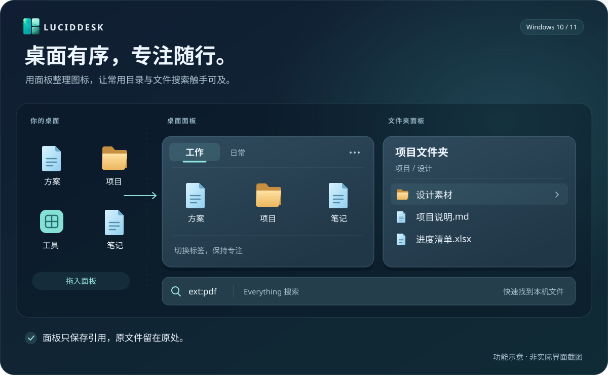

<div align="center">

# LucidDesk

简体中文 · [English](README.en.md)

**把 Windows 桌面整理成顺手的工作区。**

桌面分组 · 文件夹面板 · Everything 搜索 · 空格预览

[](https://github.com/Yuch3nE/luciddesk/actions/workflows/build.yml)
[](CHANGELOG.md)
[](#系统与兼容性)
[](docs/portable.md)
[](Cargo.toml)

[下载发布包](https://github.com/Yuch3nE/luciddesk/releases) · [开始使用](#开始使用) · [使用指南](docs/usage.md) · [更新记录](CHANGELOG.md) · [参与开发](#参与开发)

</div>



> 上图为功能示意，并非实际界面截图。

LucidDesk 是使用 Rust 开发的 Windows 桌面整理工具。将零散图标收进分组，把常用目录放到桌面，再按自己的习惯调整面板位置、标签和外观。

## 功能

| 功能 | 你可以做什么 |
| --- | --- |
| 桌面分组 | 将文件、文件夹和快捷方式拖入分组，按工作、学习或工具分类 |
| 分组标签 | 把多个桌面分组放进一个窗口，按需切换、排序、合并或分离 |
| 文件夹面板 | 在桌面浏览常用目录，按名称、类型、时间或大小排序，文件变化后自动刷新 |
| 文件搜索 | 通过 Everything 查找本机文件，直接打开或定位所在文件夹 |
| 文件预览 | 选中文件后按空格，使用 PowerToys Peek 或 QuickLook 查看内容 |

面板可以移动、缩放、折叠、自动收起，也可以吸附边缘、锁定或置顶。支持调整字体、圆角与颜色，选择纯色、亚克力或云母材质。文件夹与搜索面板独立显示，不参与分组标签合并。

**分组不会搬动你的文件。** 将图标拖入分组只改变桌面上的收纳方式；拖回桌面即可移出，关闭分组也不会删除原文件。文件菜单中的删除、重命名和剪切，以及文件夹面板中的拖入、粘贴，会操作真实文件。

## 开始使用

### 启动便携版

在 [GitHub Releases](https://github.com/Yuch3nE/luciddesk/releases) 查看已发布的构建，选择名称含 `windows-x64-portable` 的 ZIP；若尚无发布包，可按[源码构建](#源码构建)自行打包。准备好便携版后：

1. 退出正在运行的旧版，将压缩包完整解压到有写入权限的文件夹。
2. 双击 `luciddesk.exe` 启动。请保留包内其他文件，不要只复制 EXE，也不要直接在压缩包中运行。
3. 将桌面图标拖入分组；右键托盘图标，选择“新建分组”或“新建文件夹面板…”添加更多内容。

找不到面板时，点击托盘图标或选择“显示面板”，即可将面板提到前面。切换到其他应用后，普通面板仍可正常被遮挡；已设置“始终置顶”的面板保持置顶。退出时选择托盘菜单中的“退出 LucidDesk”。

### 开启搜索与预览

搜索和文件预览**默认关闭**，需要单独安装对应软件，并在设置中启用。

| 想使用的功能 | 准备与设置 |
| --- | --- |
| 文件搜索 | 安装并运行 Everything，在“设置 → Everything 搜索”中启用搜索面板 |
| 空格预览 | 安装 PowerToys Peek 或 QuickLook，在“设置 → 文件预览”中选择程序并启用 |

这些软件不包含在 LucidDesk 便携包中。更多操作和快捷键见[使用说明](docs/usage.md)。

## 升级与备份

**升级便携版时，保留原目录中的 `data` 文件夹。** 先退出程序，再更新包内运行文件；`data` 保存你的配置、面板和布局。便携包中的 `portable.marker` 用于启用此模式，请一并保留。

在“设置 → 备份与恢复”中可以打开配置目录、导出配置或恢复备份。备份只包含设置与布局，**不包含分组引用的原文件**；复制便携目录时，原文件也不会自动跟随。

普通版的设置默认位于 `%LOCALAPPDATA%\LucidDesk`。从旧版升级时会按条件继续使用原来的 `LucidPane` 数据目录；从普通版改用便携版时，可通过备份与恢复转入配置。自定义数据位置和详细升级步骤见[便携版说明](docs/portable.md)与[使用说明](docs/usage.md)。

## 界面语言

支持简体中文、繁體中文、English、日本語、한국어、Deutsch 和 Русский。默认跟随 Windows 显示语言，其他语言回退到英语。在“设置 → 语言”中手动选择，重启 LucidDesk 后生效。

语言资源内置于程序，无需下载语言包。用户命名的分组、文件名和 Windows 原生文件菜单保持原样。

## 系统与兼容性

| 环境 | 支持情况 |
| --- | --- |
| Windows 11 x64 | 优先维护与验证平台，提供纯色、亚克力、Mica 和 Mica Alt |
| Windows 10 x64 | 已由用户完成实机验证，提供纯色和亚克力；图标字体与圆角包含兼容处理 |
| ARM64、远程桌面 | 尚未完整验证 |

系统停用背景效果时，材质会回退为随深浅主题变化的底色，保留原来的材质设置。系统重新允许效果后恢复。具体验证范围见[验证记录](docs/development/validation.md)。

## 常见问题

**桌面分组无法连接怎么办？** 在“设置 → 关于”查看连接状态并尝试重新连接。程序会保留分组配置并自动重试；文件夹与搜索面板仍可独立使用。

**如何反馈问题？** 请提供复现步骤、预期与实际表现，以及“设置 → 关于 → 复制诊断”中的信息。显示异常时，附上截图、屏幕缩放比例和所选材质，便于定位。

## 源码构建

准备 Windows、Rust 1.95 或更新的 MSVC 工具链，以及 Visual Studio C++ 构建工具和 Windows SDK。先获取公开仓库：

```powershell
git clone https://github.com/Yuch3nE/luciddesk.git
cd luciddesk
```

在仓库根目录执行：

```powershell
cargo build -p luciddesk -p desktop-hook --locked
.\target\debug\luciddesk.exe
```

主程序和 `desktop_hook.dll` 必须来自同次构建并放在同一目录。生成便携包：

```powershell
.\tools\package.ps1 -Portable
```

产物位于 `target/portable/时间戳/`。测试命令、诊断构建和绑定生成见[构建指南](docs/development/build.md)。

## 参与开发

公开仓库位于 [Yuch3nE/luciddesk](https://github.com/Yuch3nE/luciddesk)，由维护者从本地开发仓库同步。欢迎通过 [Issue](https://github.com/Yuch3nE/luciddesk/issues) 和 [Pull Request](https://github.com/Yuch3nE/luciddesk/pulls) 提交问题、改进建议或代码。

- **反馈问题**：附上复现步骤、系统版本和“设置 → 关于 → 复制诊断”的信息；界面问题请附截图与缩放比例。
- **提出功能**：说明使用场景和期望的操作方式，便于讨论是否适合桌面工作流。
- **提交代码**：先阅读[架构说明](docs/development/architecture.md)，保持改动聚焦，并提供相应验证结果。涉及可见行为时同步更新文档。

提交日志前请检查其中的个人文件路径等信息。项目作者：**Yuchen95**。

## 文档

- [使用说明](docs/usage.md)：面板操作、快捷键、外观与故障处理。
- [更新记录](CHANGELOG.md)：各版本的新功能与修复。
- [便携版说明](docs/portable.md)：启动、升级与配置携带。
- [开发文档](docs/development/README.md)：架构、绘图、存储与验证。
