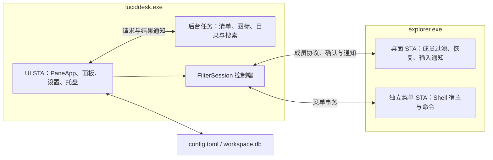

# 架构说明

LucidDesk 由主程序 `luciddesk.exe` 和桌面组件 `luciddesk_explorer.dll` 协作完成桌面整理。主程序维护面板、配置与交互；桌面组件在 Explorer 内过滤已收纳项目，并提供桌面集成能力。收纳只改变项目的显示归属，不移动文件，也不切换系统自动排列设置。

本文说明当前运行架构与关键约束。完整文件清单见[目录结构](structure.md)，构建入口见[构建与验证](build.md)。

## 进程与线程分工

图中连线表示运行时协作，不是 crate 依赖图。

| 执行位置 | 负责的状态与操作 | 边界 |
| --- | --- | --- |
| 主程序 UI STA | `PaneApp`、工作区、窗口模型、选择、布局、绘制与存储操作 | `Rc<RefCell<PaneApp>>` 留在所属线程；调用可能重入窗口消息的操作前释放可变借用 |
| 主程序后台任务 | Shell 清单审计、图标加载、目录与搜索结果 | 通过请求、结果和唤醒通知交接；Shell/COM 对象在所属线程使用，UI 接收前校验结果是否过时 |
| Explorer 桌面 STA | 原生桌面视图、过滤名单应用、成员恢复与输入通知 | 由桌面组件执行视图操作；不维护完整工作区和应用配置 |
| Explorer 菜单 STA | 独立 Shell 宿主、原生命令与菜单生命周期 | 普通命令由 Shell 执行；重命名动词返回主程序，输入仍由面板负责 |

Explorer 继续负责未收纳图标的绘制、排列、命中和原生交互。桌面组件调用 `IShellFolderView::RemoveObject` 将已收纳项目从视图集合移除；开启系统自动排列时，由 Explorer 补位。主程序使用独立窗口自绘面板内容。

菜单宿主的窗口区域为空，不显示图标。文件身份、命令转发与释放规则见[精简菜单技术文档](../win11-compact-menu-command-routing.md)。

## 模块职责

| 模块 | 职责 |
| --- | --- |
| `app/src/main.rs` | 安装器预检、DPI/COM、AppUserModelID、单实例、参数与数据路径 |
| `app/src/desktop_component.rs` | DLL 路径选择、MSIX 缓存部署、校验与旧缓存清理 |
| `app/src/pane/hybrid.rs` | 应用运行入口、Hook 会话、桌面输入及同步顺序 |
| `app/src/pane/hybrid/` | 清单审计、身份合并、图标加载、改名事务与缓存回收 |
| `app/src/pane/mod.rs`、`model.rs`、`events.rs` | 工作区与视图状态、操作分派和保存 |
| `app/src/pane/runtime.rs`、`display_layout.rs`、`recovery.rs` | 重连、窗口恢复、显示布局、备份与恢复 |
| `app/src/pane/folder/`、`folder.rs`、`search/` | 文件夹来源、目录监听、Everything 查询及搜索快捷键 |
| `app/src/pane/window.rs`、`render.rs`、`settings.rs`、`settings/` | 窗口、绘图、设置布局与输入 |
| `app/src/pane/drag_drop/`、`tray.rs`、`i18n.rs` | 分别负责拖放、托盘和本地化 |
| `desktop-core` | Shell 身份、坐标、面板与工作区模型 |
| `desktop-storage` | 配置与数据库读取、编解码和事务式保存 |
| `desktop-shell` | Shell 查询、通知、菜单、文件操作和 OLE 能力 |
| `desktop-menu` | 两侧共用的原生菜单主题与边框，不依赖 Shell 或 Explorer 实现 |
| `desktop-explorer` | 控制端会话、IPC、DLL 引导、成员过滤与控制端存活监测 |
| `desktop-graphics`、`desktop-window` | 分别提供合成层与生成绑定、显示器枚举与错误提示 |

表中的 `tray.rs`、`i18n.rs` 位于 `app/src/`。crate 的公共入口与内部目录见 [crates 导航](../../crates/README.md)；新增模块按实际功能归属放置，具体规则见[目录结构](structure.md#新增文件约定)。

## 状态与数据流

### 持久状态、窗口状态与桌面状态

- `config.toml` 保存全局偏好，`workspace.db` 保存工作区；它们是重启后恢复配置与布局的依据。
- `PaneApp` 持有当前工作区、存储、窗口、来源与可选 Hook 会话。窗口模型承载选择、滚动、悬停、重命名及绘制所需状态。
- Explorer 原生快照提供项目身份、位置与视图参数；后台清单同时考虑已被过滤的成员，避免把“不在原生视图中”误判为文件消失。
- 桌面组件接收有大小边界的 Shell 解析名集合，而不是整个数据库或窗口模型。成员以 Shell 身份和 `DesktopPlacement` 表示，显示名称不作为唯一标识。

桌面、文件夹和搜索是互斥的内容来源。桌面面板依赖过滤会话；文件夹与搜索使用独立来源。普通面板的标签共享窗口，文件夹面板加载时保持独立，详见[面板标签](pane-tabs.md)。

### 收纳与异步确认

1. 桌面项目拖入或拖出时，先持久化归属并刷新面板，再提交成员名单。
2. `submit_hidden` 等待请求被接收；`poll_hidden` 后续检查应用结果，UI 不同步等待整批桌面更新完成。
3. 请求在途时保护确认编号，并暂缓清单审计、桌面选择清除及文件菜单事务，避免不同操作基于不同成员状态执行。
4. 成员变化使已派发的旧审计结果失效；请求失败则使发布缓存失效并安排重试。

OLE Drop 在 Shell 拖动辅助对象和临时描述清理结束后才提交应用操作，避免嵌套消息提前执行收纳。文件夹面板中的真实复制、移动等文件操作仍交给 Shell。细节见[原生桌面与成员过滤](hybrid-desktop.md)和[选择与刷新时序](selection-latency.md)。

### 后台调度与绘制

Runtime 由通知和截止时间唤醒，统一安排重连、显示布局、备份及缓存回收。后台结果回到 UI 后核验身份或修订，再更新模型；不能让迟到结果覆盖新的用户操作。必要的兜底检查、动画及重试仍保留，见[后台调度](event-driven-runtime.md)。

面板使用 Canvas 与合成层绘制。纯像素结果可进入 CPU 缓存，COM 绘图资源保留在所属线程；`native_graphics.rs` 集中处理绑定之间的 COM 引用和 HRESULT 转换。图形生命周期与缓存策略见[绘图与绑定](rendering.md)和[图标内存管理](memory-optimization.md)。

## 启动、连接与退出

### 启动

安装器单独传入 `--check-desktop-component` 时，仅执行组件释放状态预检并返回退出码，不初始化 COM、窗口、配置或 Hook。正常启动则执行以下流程：

1. 设置每显示器 DPI 感知，初始化 COM STA，设置稳定的 `Yuchen95.LucidDesk` AppUserModelID，并解析 `--title`。
2. 获取当前会话的单实例互斥量；重复启动广播唤起消息后退出。不同打包形式共用这一实例约束。
3. 选择数据目录，初始化 OLE 和图形生命周期守卫，读取存储、语言、字体、工作区及显示布局。
4. 尝试连接 Explorer：先注册通知、捕获清单并确认桌面视图未变化，再准备 DLL、创建 `FilterSession`，合并清单并发布成员名单。
5. 按来源和连接状态创建可用窗口，建立托盘与运行时监控，进入消息循环。桌面连接失败记录状态并等待重连，不阻止独立来源继续运行。

数据路径优先级为显式环境变量、`portable` 标记对应的程序旁 `data`，最后是 LocalAppData 默认目录。现有目录复用和存储兼容规则见[存储与版本约定](storage.md)。

### 打包形式与 DLL 路径

| 条件 | DLL 加载位置 |
| --- | --- |
| EXE 同目录没有 `msix` 标记 | EXE 同目录的 `luciddesk_explorer.dll` |
| 有 `msix`，系统明确返回无包身份 | EXE 同目录的 DLL，不创建组件缓存 |
| 有 `msix` 且具有包身份 | `LocalState\DesktopComponent\<SHA256>\luciddesk_explorer.dll` |

`portable` 控制便携数据目录；`installed` 是安装版标记，不参与 DLL 路径选择。MSIX 标记用于选择部署方式，不证明商店来源。包身份查询或 LocalState 获取发生其他错误时报告失败，不静默回退。

MSIX 每次连接校验缓存内容，使用部署锁和原子替换修复缺失或损坏文件，并持有校验后的文件句柄直到加载完成。旧缓存仅清理已释放的组件；占用时保留。完整规则见[MSIX 桌面组件加载](../msix.md#桌面组件加载)。

### 退出与异常终止

正常退出停止监控和托盘，在不持有 `PaneApp` 可变借用时分离 Hook，再释放窗口与渲染资源。分离恢复原生视图成员、撤销回调和计时器；在用户没有改变布局的前提下，按原视图顺序恢复基线坐标。

`filter/library.rs` 等待菜单线程结束、回调计数清零并确认桌面 STA 离开 DLL 回调栈，再由原生线程释放模块引用。Explorer 无响应时保留引用，避免卸载仍在执行的代码；新连接检查残留组件，安装器也检查占用状态。

主程序异常消失时，Explorer 内的存活监测触发清理；不能依赖被强制终止进程执行 Rust 析构。

主程序正常释放窗口后，`GraphicsLifetime` 清空 WinRT 合成运行时、DirectComposition 设备和 GPU 缓存，最后退出 OLE/COM；正常返回和错误返回均遵循资源析构顺序。资源约束见 [Rust API 与资源约定](rust-api-review.md)。

## 故障与兼容边界

| 情况 | 当前行为与限制 |
| --- | --- |
| Explorer 断开或重启 | 丢弃失效会话，保留桌面归属并安排重连；文件夹与搜索独立运行 |
| Windows 接口不可用 | 运行时探测失败后报告桌面集成状态，不假定所有系统构建兼容 |
| 原生视图刷新或列表变化 | 重新过滤；一秒检查补查遗漏并监视控制端，期间可能短暂显示原生项目 |
| DLL 仍被占用 | 保留引用或旧缓存，阻止不安全替换；进程退出不等于 DLL 已释放 |
| 存储格式不兼容 | 按存储层规则报告错误并保留原文件；不提供通用旧库自动迁移 |
| 菜单、窗口或绘图发生重入与失败 | 依赖事务状态、线程归属和释放顺序恢复，不能绕过现有清理路径 |

当前使用 `FilterSession` 和成员协议 v1；原生桌面依赖运行期 Shell 能力探测。Windows 11 x64 为优先维护平台，具体检查要求和支持边界见[验证与兼容边界](validation.md)。

修改架构时，应同时检查状态归属、消息重入、过时结果处理和资源释放。涉及窗口顺序见[面板层级](pane-drag-order.md)，涉及语言与字体刷新见[本地化指南](localization.md)。

## 规划中的 CLI 接口

面向脚本与 Agent 的控制台、协议和批量计划设计见 [CLI 与 Agent 接口设计](cli-agent.md)。目前已实现独立 CLI 和只读本地管道服务：通信线程通过独立隐藏窗口消息将查询交给 UI STA，查询不触发维护任务或数据库保存。写命令和计划应用仍处于设计阶段。
