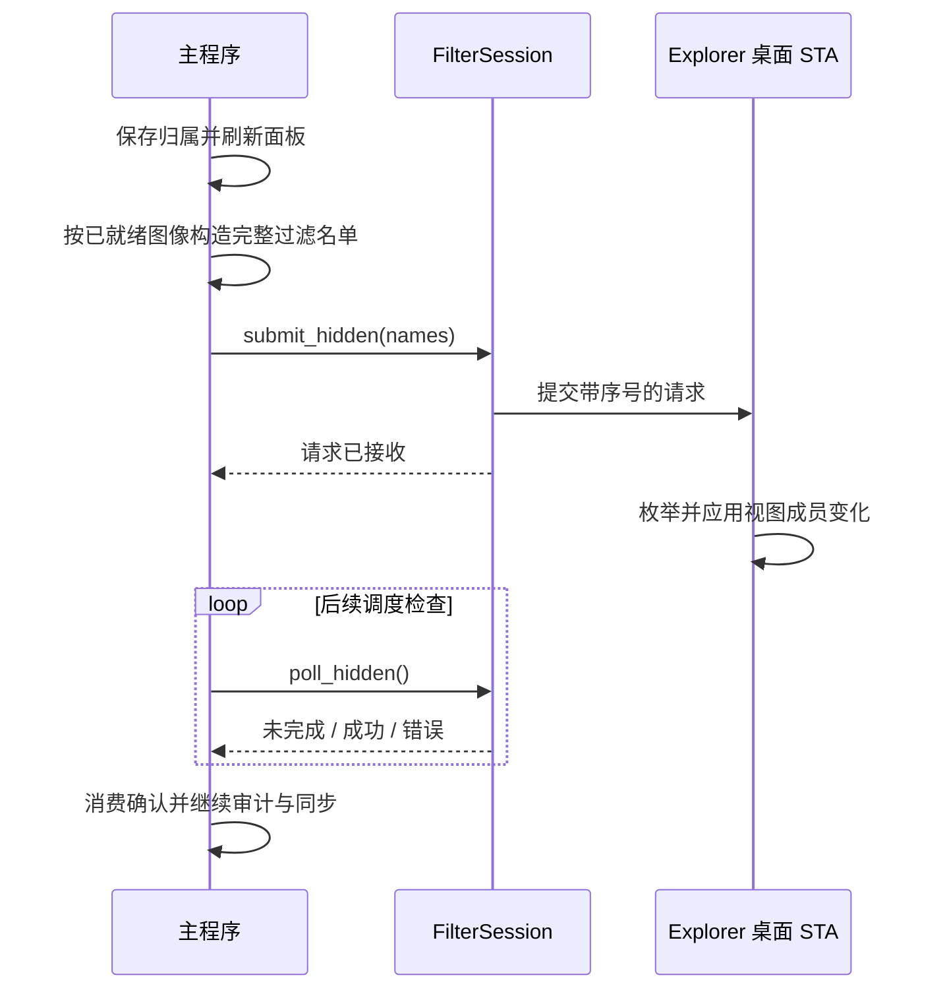

# 原生桌面与成员过滤

本文说明桌面项目从收纳、同步到恢复的完整流程。应用使用 `FilterSession` 管理 Explorer 视图成员，面板由独立窗口自绘；进程分工和 DLL 生命周期见[架构说明](architecture.md)。

## 收纳与显示

收纳改变项目的显示归属，不删除或移动源文件，也不切换系统自动排列设置。Explorer 绘制未收纳项目，LucidDesk 绘制面板内容。DLL 在 Explorer 桌面 STA 上调用 `IShellFolderView::RemoveObject` 移除对应视图成员；自动排列开启时由 Explorer 补位，关闭时沿用系统布局行为。

需要区分三种集合：

| 集合 | 含义 | 维护位置 |
| --- | --- | --- |
| 工作区成员 | 用户保存的桌面分组归属 | 主程序与持久化工作区 |
| 过滤名单 | 当前应从原生视图移除的完整 Shell 解析名集合 | 控制端发布，Hook 保留并应用 |
| 原生视图成员 | Explorer 当前可见的桌面项目 | Explorer；可能因刷新短暂变化 |

工作区成员不会立即全部进入过滤名单：只有图像已就绪的成员参与过滤，初次图标加载失败时保留原生图标，避免两边都没有可用显示。原生视图中缺少某项目，也不等于该文件已删除。

### 一次收纳的同步顺序

`submit_hidden` 不等待 Shell 完成整批枚举与更新；`poll_hidden` 根据对应请求序号检查完成结果。前一请求未完成时不提交另一事务，成员同步在途期间暂缓清单消费、桌面选择清除和文件菜单准备。

名单排序、去重后与发布缓存比较，只在变化时提交；Hook 自行保留成功应用的过滤状态。发送前先使发布缓存失效：IPC 错误不能证明 Explorer 未执行请求，错误或部分更新后必须重新发布权威名单，不能因名单“看起来没变”跳过补偿。收到失败确认时清除在途状态、标记待同步并由运行时重试。

桌面到分组的 OLE Drop 先完成 Shell 拖动辅助对象和临时描述清理，再通过排队动作提交收纳，避免双方 STA 相互等待。文件夹面板的文件复制和移动不使用这套收纳协议。

## 清单与刷新

### 身份与清单合并

`hybrid/inventory.rs` 合并当前原生视图和独立桌面来源。来源中只补入已有分组成员，不把 desktop.ini 等无关隐藏项目显示在面板中。文件 ID 支持改名后保留归属；不完整快照、重复身份或来源枚举错误不会提交为删除。

### 有界快照读取

原生布局和轻量修订读取会核验前后项目标识、顺序、视图窗口和图标参数；项目数量变化、重复标识及无效标识也会使本次读取作废。索引越界（`E_BOUNDS`）或一致性检查失败时，从头重新读取，单次调用最多三次；其他接口错误直接返回。持续变化时保留现有面板数据，由既有调度稍后重试，不调用桌面刷新。逐项读取失败会在日志中附带接口名、索引和开始时的总数。这是有界一致性检查，不会锁住 Explorer，也不保证读取结束后桌面不再发生变化。

### 通知、后台审计与过时结果

常驻 STA 检查原生视图修订和独立来源 PIDL 集合；连续无变化时，检查间隔按 2、4、8 秒退避，上限为 8 秒。变化通知触发优先核对，读取期间的新通知保留到下一次强制读取；仅在修订、成员或通知变化时解析完整元数据。后台结果携带请求时的分组成员键，丢弃已过期的结果。图标通知和回收站空满变化继续使用单独刷新路径；通知缺失时，清单变化可能等待约 8 秒才被发现。

文件身份和解析名都参与成员修订判断。即使改名前后的文件 ID 相同，使用旧路径的在途结果也不能覆盖新身份。拖放改变归属时同样使旧结果失效；选择互斥和请求顺序见[选择与刷新时序](selection-latency.md)。

上述退避间隔是调度条件，不是严格的实时响应期限。控制端清单审计与 Explorer 内的一秒重滤承担不同职责，不能互相替代。

## 图像就绪与缓存

分组中使用的图像继续保留；最近移出的图像允许短期复用，最多 64 项且像素缓冲容量总计不超过 8 MiB，超过预算先淘汰最早移出的项目。运行时按最早过期时间安排单次唤醒，移出 30 秒后回收，菜单或预览暂停期间延后处理。普通维护不延长期限，快速移回时可直接复用共享图像。Shell／图标通知和清单变化提前清除闲置缓存，避免复用已知过期内容。这些预算仅针对闲置图像，不是整个进程的内存上限。

同步路径清除已移出项目的失败重试记录。初次加载和刷新结果都核验当前分组归属，避免迟到结果重新缓存已移出的图像；像素未变化时保留原有共享图像，复用 GPU 缓存。

缓存所有权、像素去重和预算说明见[图标内存管理](memory-optimization.md)。图像缓存影响显示与复用，不替代工作区归属或文件存在性判断。

## Explorer 侧过滤与重绘

DLL 在列表变化后排队重新过滤，并用一秒定时器补查遗漏变化；自发的 RemoveObject 不递归触发自身过滤。刷新期间可能短暂重新出现项目，目前不承诺完全消除闪现。

绘制前的过滤核对仅在实际调用添加、移除或定位接口前暂停原生重绘，无变化的枚举不触发整窗失效。枚举期间仍阻挡 COM 重入绘制，避免新插入的托管成员先显示出来。过滤名单由 Hook 保留并每秒补查，控制端仅在名单变化时发布，普通清单读取失败时保留已成功发布的名单。改名事务的身份交接仍会按需重新发布。

恢复坐标时，未添加项目且坐标已经相同便跳过定位接口；添加项目后仍按初始顺序恢复，以兼容自动排列。Peek、改名事务、退出或部分写入失败后的恢复仍可能产生必要重绘；`IShellView::Refresh` 仅用于成员恢复失败后的兜底。只读失败连续超过现有重试预算后也会进入恢复，不能据此承诺桌面永不刷新。

## 菜单与恢复

### 不同操作的事务边界

| 操作 | 原生成员与重绘处理 | 身份及结束处理 |
| --- | --- | --- |
| 文件菜单 | 保持过滤，独立宿主拥有自己的选择 | 准备时校验身份；普通命令交给 Shell，`rename` 返回面板 |
| Peek 预览 | 调用作用域内暂时恢复成员并暂停原生列表重绘 | 结束后重新过滤并恢复重绘 |
| 托管成员改名 | 暂停绘制但保持过滤 | 保存新身份、交接过滤身份、发布完整名单后结束事务 |
| 退出或控制端消失 | 恢复仍存在的原生成员，解除重绘暂停 | 用户的新布局操作优先于旧坐标基线 |

文件菜单不需要临时恢复真实桌面选择。菜单宿主、改名编辑器和身份补偿见[菜单与重命名](pane-item-rename.md)；底层命令路由见[精简菜单技术文档](../win11-compact-menu-command-routing.md)。

### 成员与坐标恢复

退出或控制端消失时重新加入仍存在的项目。没有用户布局操作时，按原视图顺序批量恢复原坐标；用户的拖动、排序和显示器变化优先于旧基线。恢复失败时请求 Shell 刷新，避免只剩部分原生项目。文件已经删除或改名时，不使用过期路径重新加入图标。

恢复成员与卸载 DLL 是两个阶段。清理还必须撤销回调、等待菜单线程和桌面回调退出，才能释放模块；不能把主程序退出当作 DLL 已可替换的证据。控制端异常退出也依赖 Explorer 内的存活监测解除事务重绘暂停。具体释放顺序见[退出与异常终止](architecture.md#退出与异常终止)。

## 边界

- 原生桌面接口通过运行期探测使用，不能保证所有 Windows 构建及 Shell 扩展组合兼容；Windows 11 x64 是优先维护平台。
- 快照读取不会锁住 Explorer。持续变化可能导致读取放弃并延后重试，但不能把读取失败当成成功删除。
- 刷新期间可能短暂重现原生项目；恢复失败允许 Shell 刷新兜底，不承诺完全无闪现或永不刷新。
- 桌面会话失效时保留分组归属并安排重连，独立文件夹和搜索来源继续运行。

### 修改后的验证重点

| 修改范围 | 至少验证 |
| --- | --- |
| 过滤发布与确认 | 单个在途请求、失败后的重新发布、空名单回滚和迟到确认 |
| 清单或身份 | 改名、删除、重复身份、不完整读取及读取期间发生的新通知 |
| 图标加载与缓存 | 初次失败、迟到结果、移出再移回、通知失效和预算回收 |
| 菜单、Peek 或改名 | 成功、取消、异常路径均结束事务并恢复必要的重绘状态 |
| 分离与恢复 | 正常退出、控制端异常消失、用户改变布局后的恢复，以及 DLL 释放 |

自动检查不替代多屏、混合 DPI、自动排列开关和实际 Shell 扩展环境中的回归。检查方法与平台限制见[验证与兼容边界](validation.md)。
