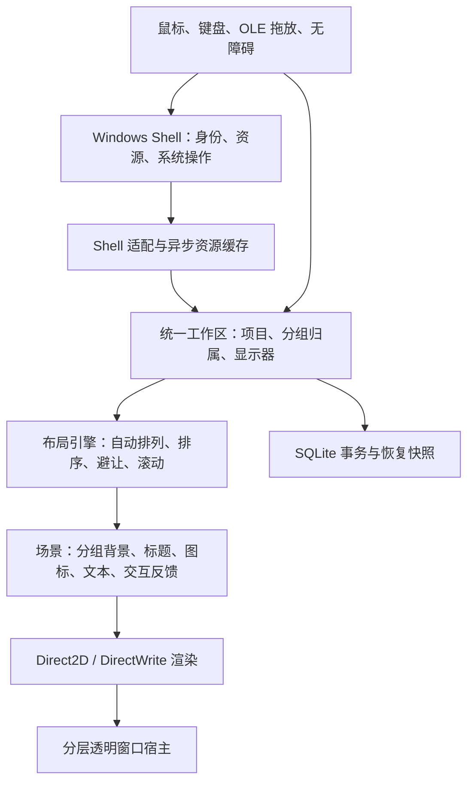

# LucidPane 新方案：以 Fences 式使用体验为目标

日期：2026-09-07。状态：独立视觉/布局预览已实现，完整方案尚未完成。
后续路线复核：用户重新强调原生体验，全自绘桌面接管不再视为已确定的下一步。
参见 [原生桌面路线调研](native-desktop-options.md)；下文保留已实现预览的设计背景。
具体范围与验证结果见 [实现记录](preview-implementation.md)。

本方案替代前两次实现，以及本轮曾考虑的“必须嵌入原生 Shell 控件”假设。
用户已明确否定旧方案，允许重新选择架构。验收依据是产品效果、Windows 风格和自动排列，
不以保留旧代码、Explorer 原桌面 HWND 或某项控件技术为前提。
当前默认运行独立预览，不修改用户桌面显示或自动排列设置。

## 1. 架构决定

推荐使用：**独立的桌面布局与分组引擎 + Windows Shell 资源和操作服务 + 分层透明渲染。**

LucidPane 负责可见内容的承载和布局。Windows 继续负责真实文件、Shell 身份、图标/缩略图
资源、打开方式和原生菜单等系统能力。采用系统资源不意味着交互自动完整，应用需要实现
输入、选择、键盘和无障碍，并正确转交 Shell 操作。

应用启用后，原 Explorer 图标视图需要暂时隐藏以避免重复；Explorer 进程、文件和任务栏继续
运行，自动排列设置不修改。LucidPane 的未分组区域和各分组分别自动排列。
退出或恢复失败时回到原 Explorer 桌面。这里保留的是自动排列功能和系统设置，显示期间的
排列由 LucidPane 执行，不能声称仍由被隐藏的 Explorer 视图负责排列。

相比早期接管原型，显示承载的思路有共通之处；推翻的是其临时 GDI 画法、各处独立决定尺寸
与布局、窗口整体透明以及缺少完整交互和视觉验收的具体实现。仅换 D2D 名称不会自动改善效果。

## 2. 产品行为

| 操作 | 期望结果 |
| --- | --- |
| 新建分组 | 创建有完整半透明背景和标题的内容容器 |
| 拖动分组 | 背景、标题、图标一起移动；不调用原桌面图标坐标接口 |
| 缩放分组 | 组内按可用宽度自动换行，超出高度可滚动 |
| 拖入或拖出 | 改变明确的成员归属，来源和目标各自自动补齐空位 |
| 自动排列 | 未分组区域和每个分组独立执行，不要求关闭系统自动排列 |
| 调整组内顺序 | 更新稳定顺序，图标继续占据网格；按名称排序时明确使用排序结果 |
| 折叠分组 | 保留标题并隐藏该组内容，成员关系不变 |
| 删除分组 | 图标回到未分组区域，真实文件保留 |
| 打开、右键菜单 | 使用原项目的 Shell 身份执行系统操作 |

分组、自动排列、排序和自动分类分别建模。自动排列是填充网格；排序是确定先后；自动分类
是决定归属。不能用其中一个功能冒充另外两个。

未分组区域应避让分组占用区域；移动分组过程中采用预览，结束后再完成受影响区域的重排，
避免图标持续跳动。边界外拖放回到最近可用位置，多屏布局由统一模型决定。

## 3. 外观必须先通过验证

- 图标和缩略图通过 Shell 获取，保留资源的色彩和 alpha，不自制替代图、不统一染色。
- 根据目标像素尺寸请求资源，不把固定的 32px 图标直接放大；缓存键包含身份、尺寸和资源版本。
- 快捷方式箭头、同步状态等覆盖标记单独纳入验证，不能假设一个图片接口自动包含所有标记。
- 名称使用 Shell 显示名；尊重扩展名偏好，不再统一截掉文件后缀。
- 图标尺寸、字体和间距从当前桌面/系统读取作为基线，DPI、字体和主题变化触发更新。
- 文字、换行、阴影、选中态由应用实现并与真实桌面对比；不宣称系统资源等于像素级原生桌面。
- 背景层使用独立透明度，图标不随背景变暗；禁止整窗 alpha 同时淡化文字和图标。
- 初始视觉建议：6–8 DIP 圆角、约 30 DIP 标题、低对比度细边界、低饱和度半透明背景。
  数值是原型起点，按实际显示效果调整，取消截图中的粗白框。

第一版先实现真正的半透明填充。毛玻璃模糊作为单独能力验证，不把普通透明称为 Acrylic。

Shell 提供图标/缩略图接口，系统提供字体等设置读取接口；这些是资源来源，不是外观自动合格
的保证。[IShellItemImageFactory](https://learn.microsoft.com/en-us/windows/win32/api/shobjidl_core/nn-shobjidl_core-ishellitemimagefactory)、
[SystemParametersInfoW](https://learn.microsoft.com/en-us/windows/win32/api/winuser/nf-winuser-systemparametersinfow)。

## 4. 实现分层

继续使用 Rust + Win32。更换语言本身无法解决桌面层级、透明合成、Shell 交互问题，因此不为
重写而引入 WebView 或新 UI 运行时。只有数据模型、存储和身份层经审查后复用，其余按新边界实现。

渲染首先用 Direct2D/DirectWrite 生成预乘 alpha 内容，通过分层窗口的逐像素合成验证真实透明。
`UpdateLayeredWindowIndirect` 路线可作为第一版基线；需要评估缓冲区复制成本，以脏区域和按需
重绘控制开销，不进行持续全桌面 60fps 刷新。性能不合格时再验证 DirectComposition 后端，
共享同一场景模型，不把 GPU 合成与命中穿透当作已经解决的问题。
[微软分层窗口与 Direct2D 示例](https://learn.microsoft.com/en-us/archive/msdn-magazine/2009/december/windows-with-c-layered-windows-with-direct2d)。

宿主按“每组有界窗口 + 每屏未分组表面”组织，由一个桌面会话管理器控制层级与生命周期。
每个组的背景和内容属于同一场景，避免挖空边框与 Explorer 图标各自独立移动。
窗口区域、逐像素透明和输入命中分别测试；全透明的空白桌面区域不能截获右键或拖放。

## 5. 归属与交互闭环

项目采用稳定 `ShellIdentity`；归属保存为未分组或某个 `GroupId`，不能再由屏幕坐标猜测成员。
布局位置从归属、顺序、图标规格、容器尺寸和显示器信息计算；不把外观坐标充当业务关系。

分组间拖放先验证目标，再提交归属事务，最后更新场景。数据库失败则保留原归属；显示失败
可从已提交状态重建，不能造成两边都丢失或重复。默认分组不执行真实移动或复制。

Shell 适配层负责双击打开、原生右键菜单消息转发和 OLE 数据对象；应用内转组与对外文件拖放
采用不同的操作意图。重命名/删除真实文件必须尊重 Shell 结果，不能用移出分组假冒删除。
缩略图与第三方 Shell 调用移出输入/绘制主路径，采用合适的 COM apartment 与取消/超时隔离策略。
卡住的 Shell 扩展需要进程级隔离方案，不能靠强制杀线程解决。

键盘多选、焦点、Enter/F2/Delete、输入法和 UI Automation 都是自绘视图的实现责任。
基础交互闭环完成前，不把界面宣称为完整 Windows 原生交互。

## 6. 桌面会话与恢复

桌面层挂载是专门的兼容模块。仅给 popup 设置 Shell owner 不能证明 Win+D、焦点、层级或
Explorer 重启行为正确；这些必须实测。私有 WorkerW/DefView 窗口树依赖若不可避免，应隔离并
按系统版本验证，失败则恢复原桌面，不向 Explorer 注入代码。

显示切换采用状态机：准备 → 加载并验证 → 隐藏原视图 → 工作 → 恢复。只有完整资源与输入
路径就绪后才隐藏原视图；初始化失败保持原桌面。保存原显示状态和自动排列设置用于验证，
不通过临时关闭自动排列实现任何操作。

覆盖正常退出、进程崩溃、Explorer 重启、Win+D、注销、睡眠恢复、显示器断开和混合 DPI。
恢复策略尊重用户在运行期间主动修改的设置，不盲目用旧快照覆盖新偏好。隐藏视图后的设置
监测及多实例互斥也必须验证。退出时还原原桌面显示；不默认把应用分组映射成一批 Explorer 坐标写入。

## 7. 为什么不选择另外两条路线

| 路线 | 判断 |
| --- | --- |
| 在原桌面上圈框并移动原图标 | 与同一视图内的自动排列冲突，无法表达独立容器，淘汰 |
| 各分组嵌入 IExplorerBrowser | 原生行为有优势，但普通结果视图的透明、文字样式和分组控制未被证明适合目标；不作为主线 |
| 独立布局与渲染，委托 Shell 资源/操作 | 最能控制完整分组、自动排列和透明背景；代价是需要认真实现外观、交互和无障碍，选为主线 |

微软文档把 `FWF_TRANSPARENT` 限定于桌面用途，不能把它当作任意嵌入 Shell 视图的透明皮肤开关。
[FOLDERFLAGS](https://learn.microsoft.com/en-us/windows/win32/api/shobjidl_core/ne-shobjidl_core-folderflags)。
不猜测 Stardock 的内部实现；本方案依据目标行为和公开 Windows 能力选择。

## 8. 交付与验收顺序

1. **视觉原型**：一个完整填充的分组，真实 Shell 图标、文件名、选中态和缩略图；在浅/深壁纸及
   100%、150%、200% 缩放下实拍对比。此时不隐藏原桌面。图标失真、文字不清或出现黑底/粗框则返工。
2. **布局原型**：两个分组和一个未分组区域，验证自动排列、缩放换行、拖入拖出、整体移动和折叠。
   使用测试项目，不先操作用户桌面的真实文件。
3. **Shell 交互**：右键菜单、打开、键盘、多选、OLE 和基本无障碍；验证快捷方式和系统虚拟项目。
4. **桌面集成**：通过 Win+D、多屏、前后台切换和恢复矩阵后，才提供完整接管试用路径。
5. **产品化**：迁移预览与回退、托盘、设置、分类规则和性能优化。旧数据库保持独立，不强行迁入错误布局。

验收报告必须分开写“单元/集成测试通过”“实机交互通过”“视觉已确认”。不能再以空集合的
只读测试、窗口区域测试或 cargo build 成功，推断真实拖动、外观和 Fences 式体验已经完成。

首个可评审交付是一个真实、完整、风格正确的分组原型，而不是再次提供能启动的空框。
