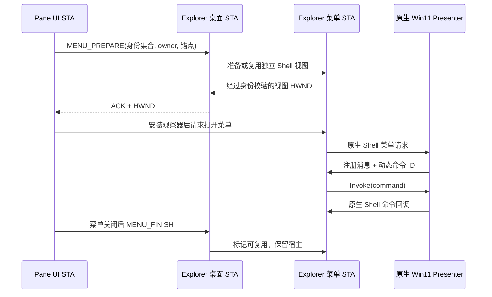

# Win11 独立 Shell 菜单点击分发修正

2026-09-15，在当前 Win11 x64 主机验证。目标是独立 Shell 视图的精简菜单；没有嵌入、裁剪或隐藏一个完整 Explorer 文件窗口。

## 根因与证据

独立宿主已经创建了原生菜单 Presenter，但缺少完整 Explorer 浏览器承担的命令消息转发。

1. 菜单弹出窗口处于 enabled 状态，`WindowFromPoint` 命中菜单，`WM_NCHITTEST` 返回 `HTCLIENT`。
2. 点击顶部“重命名”后，独立 `SHELLDLL_DefView` 收到注册消息 `FILE_EXPLORER_CONTEXTMENU_INVOKEMENUITEM`，本轮消息 ID 为 `0xc162`，命令 ID 为 `0x7913`。旧实现把它交给默认窗口过程，菜单没有执行重命名。
3. 本机缓存符号和系统 DLL 的只读分析显示，`CDesktopBrowser::_WndProcBS` 处理这条注册消息时调用 `IContextMenuPresenter::Invoke(UINT)`，即该接口第 8 个虚表槽位（从 0 开始）。独立 IExplorerBrowser 宿主没有提供这一转发。
4. 为独立视图补上该转发后，同一菜单点击产生 `command_route.invoke` / `command_route.return`，随后菜单关闭、原生重命名编辑框出现。再次选择“属性”（本轮 ID `0x7914`）打开了测试文件的属性窗口。

不能把所有失败都归因于鼠标命中或线程循环。另有一次自动化操作在点击之前使宿主失焦、菜单关闭，导致点击落到背后的视图；这类结果需与真正收到菜单命令但没有分发的故障区分。

## 修改

### 产品结构

Pane 保留现有图标绘制、布局、选择和编辑器。真实桌面持续过滤 Pane 中的项目。菜单使用另一份包含选中项目的原生 Shell 视图，两份视图不共享选择状态；既不临时恢复桌面成员，也不复制真实桌面 ListView。

### 接入点

| 位置 | 职责 |
| --- | --- |
| `app/src/pane/window.rs` | 捕获完整选中集合；释放模型借用后打开菜单；接收重命名结果；键盘菜单锚定选中图标 |
| `crates/desktop-shell/src/native_menu.rs` | 前台授权、菜单观察器、关闭后有条件返回 Pane 焦点 |
| `crates/desktop-hook/src/filter/engine.rs` | 验证 owner 所属进程，管理准备/结束协议，菜单错误不撤销桌面过滤 |
| `crates/desktop-hook/src/filter/menu/worker.rs` | 常驻独立 STA，序列化准备、结束与消息派发；超时取消过期准备请求 |
| `crates/desktop-hook/src/filter/menu.rs` | 原生结果视图、选中身份校验、视图命令消息转发及统一菜单请求 |
| `crates/desktop-hook/src/filter/menu/presenter.rs` | 封装私有 COM 接口，处理注册消息对应的 Invoke，保留回调生命周期 |
| `crates/desktop-hook/src/filter/menu/commands.rs` | 包装本次 IContextMenu，记录动态编号起点，查询标准动词并转发普通命令 |
| `crates/desktop-hook/src/filter/menu/callback.rs` | 保留原生 Shell 回调；将 rename 转回 Pane，其他命令继续交给原生回调 |

### 宿主复用与生命周期

- 每个过滤会话持有一个菜单 STA。`MENU_FINISH` 释放本次菜单使用权，不立即销毁 STA 和 Shell 视图。
- 同一 owner、同一有序目标集合可复用，但每次都重新解析目标并比较视图中完整的 Shell 身份集合，再恢复选中项和弹出锚点。删除、改名或集合不匹配不能复用旧目标。
- 目标改变时创建新的已验证视图。旧宿主若仍拥有可见命令窗口（例如属性），先保留，待窗口关闭后在菜单 STA 上释放。
- 属性窗口仍打开时，不复用它的宿主打开下一份菜单，避免禁用 owner 或模态状态影响输入。
- 控制进程退出、过滤会话断开时，worker 请求通道断开，宿主和 COM 对象在其创建线程清理；不停止或重启 Explorer。
- 生产宿主使用空窗口区域提供焦点与 Shell 上下文，本身不绘制文件内容。项目已有 `LUCIDPANE_INSPECT` 测试入口只改变窗口的可检查样式，菜单宿主仍保持空区域。

### 输入与错误边界

- 菜单 HWND 的正常命中只是输入到达窗口的证据，不能替代命令消息和最终功能结果。
- 菜单先关闭、再执行命令是异步链路。观察器等待关闭稳定后才结束请求，不把 XAML 的零尺寸初始化窗口当作已显示菜单。
- 属性或其他应用获得前台时不抢回 Pane 焦点。只有前台仍是菜单宿主时才返回 Pane。
- Pane 图标继续自绘，改名输入仍由既有 `RenameItem` 处理。菜单通过 `IContextMenuSite::DoContextMenuPopup` 打开；包装的 `IContextMenu` 记录本次 `QueryContextMenu` 的编号起点，回调以 `command - first` 查询 `GetCommandString(GCS_VERBW)`。仅标准 `rename` 动词转换为 Pane 重命名结果，其他命令继续交给原生 Shell 回调。
- 不能依赖隐藏视图一定发送 `LVN_BEGINLABELEDIT`。本机实际 Pane 的命令已到达 `Invoke`，但未收到这条通知；这是“菜单关闭、Pane 没有编辑框”的第二个断点。视图通知只保留为兼容补充，主路径在开始隐藏编辑之前拦截标准动词。
- 识别重命名后先结束原生视图的菜单会话，再通知 Pane。初始化失败或编号范围无效时不猜测命令编号；每次打开重新记录范围，准备失败清除旧范围。
- 不把菜单错误视为桌面过滤失败；准备失败和命令结束各自清理状态，保留真实桌面的过滤成员。
- 冷启动和第三方扩展加载仍有成本；复用减少重复初始化，不等于已经量化消除了所有忙碌指针或扩展加载时间。

- 生产 `menu_messages` 在独立视图上识别注册消息，转给该视图自己的 NativePresenter。
- 使用 `RegisterWindowMessageW` 获取运行时消息 ID；不写死 `0xc162`、重命名 ID 或其他命令 ID。
- 沿用原生 Presenter 的关闭和命令选择；普通命令交给 Shell，重命名通知 Pane，不使用固定命令编号或模拟键盘操作。
- 消息处理期间保留 COM/Rc 引用，避免命令重入关闭宿主时释放正在使用的对象；已关闭 Presenter 不再执行命令。
- 原型使用仅安装在自身视图上的 RAII subclass 验证同一通路，销毁时解除。

### 提交改名后的身份交接

只验证编辑框出现不足以覆盖提交改名。用户随后复现：提交后项目先回桌面再收纳，下一次菜单变为经典菜单且重命名无效。旧实现调用 Shell 后直接关闭编辑框，直到后台轮询才更新过滤路径，因此存在确定的旧身份窗口。

- `rename_shell_item` 使用公开 `IFileOperationProgressSink::PostRenameItem` 获取 Shell 返回的新项目，不拼接推测路径，也不等待轮询确定新身份。
- 托管桌面项目由 `hybrid/rename_transaction.rs` 提交。`UPDATE_BEGIN` 只暂停桌面绘制，保持成员过滤；Shell 完成后，`REPLACE_IDENTITY` 交接新 PIDL、过滤名字和恢复坐标，Pane 同步保存新身份、标签和分组位置，再发布完整集合并 `UPDATE_END`。
- 更新期间暂停 Pane 后台清单接受；审计版本同时包含稳定 ID 和解析名，拒绝改名前已发出的旧路径结果。仅使用文件 ID 不能识别这种过期结果，因为改名保留文件 ID。
- 晚到的 Shell 插入通知在桌面下一次绘制前重新过滤。失败、取消和控制进程退出均释放绘制暂停；此流程不使用恢复全部桌面成员的 `PAUSE`。
- 更换菜单目标时，先验证新目标，再销毁无可见附属窗口的旧宿主，最后初始化新宿主。避免新 Presenter 初始化后再关闭旧 Presenter 的交错生命周期。是否彻底解决改名后的经典菜单退化，需要提交后的实机复测确认。

### 鼠标右键误显示访问键

用户截图中的 `T / C / M / S / D` 灰色字母框是 XAML 访问键显示模式，区别于菜单右侧正常的 `Enter` 文本。独立菜单通过 `DoContextMenuPopup` 打开，绕过 `CDefView::_OnContextMenu` 的鼠标来源标记；此前注册消息中的键盘来源参数也未被消费。

本机 Shell 分析确认：原生鼠标上下文菜单带有 presenter flag `0x8`；菜单加载完成时，如果输入相关位 `0xE` 均未设置，会自动进入访问键显示模式。分析使用已有本机符号缓存，仅用于确认行为，运行时不读取对象偏移或下载符号。

首版尝试在私有 COM 服务边界包装 Presenter，统一普通显示入口和可选的 `IContextMenuPresenterTipTest` 的鼠标标记。虽然 19 项单元测试通过，但实机右键触发 Explorer 的 `Windows.UI.FileExplorer.dll` 访问冲突（`0xc0000005`，本机构建故障偏移 `0xc4836`），继而导致 Pane 提示“桌面过滤连接已断开”。首版随即撤下；后续修正版见下文。单元测试仅验证模拟接口，未覆盖原生 Presenter 的实现约束。

随后独立进程查明崩溃根因：`presenter.cast::<IUnknown>()` 返回 WinRT 对象的规范 IUnknown 身份，其指针和函数表不同于 `IContextMenuPresenter`。旧转发层直接按 Presenter 函数表调用该指针，导致错误调用；原来的模拟对象恰好共用一个函数表，因此未检出。

当前修正版的 `input::wrap` 无论收到哪种 IUnknown，均重新 `QueryInterface(IContextMenuPresenter)`，保留该查询返回的准确接口指针，再转发私有方法。独立原生 COM 测试已确认身份指针和 Presenter 指针不同、适配层持有的是后者，并成功调用原生 `IsContextMenuOpen` 和 `IsReadyForNewContextMenu`。原生测试默认忽略，仅显式运行在独立测试进程；普通测试覆盖两条显示入口的参数、鼠标/键盘交替状态和引用释放。

修正版在 `DoContextMenu` 及可选 `IContextMenuPresenterTipTest` 两个显示入口设置鼠标来源位 `0x8`，键盘来源只清除此位，其他标记与显式访问键命令均透传。每次打开使用 Pane 传来的来源参数。原生关闭和命令回调保留，Pane 图标继续自绘。此私有接口/标记仍需随 Windows 构建回归，不代表全版本兼容。

撤回后重新构建并启动隔离测试版：实际右键重新弹出精简菜单，点击“重命名”进入自绘 Pane 的编辑框，Esc 取消，未提交改名；Hook 原有 18 项测试通过。此次恢复不代表访问键问题已经修复。

接口指针修正后的验证：19 项普通 Hook 测试通过，1 项原生 COM 测试单独显式运行通过；独立 `shell_pane_probe --compact --input-adapter --folder` 的直接调用正常打开/关闭经典菜单（独立进程受 Shell 进程门控，不能据此声称精简菜单通过）。随后接入隔离 Pane，鼠标右键无自动字母框，主动 Alt 可显示访问键，Esc 可关闭；Shift+F10 能打开精简菜单，再次鼠标右键无字母残留；点击重命名进入 Pane 编辑框并 Esc 取消，未更改文件名。本轮 Explorer 保持同一进程存活。

属性菜单自动点击遇到工具坐标映射错误，未确认本修正版的属性窗口结果；此前版本的手工通过不能替代本次复测。原生接口回归命令：`cargo test -p desktop-hook --lib --offline native_presenter_uses_queried -- --ignored --nocapture`，在独立测试进程中执行，不注入 Explorer。

### 菜单弹出前的忙碌光标

用户反馈是菜单出现前持续转圈，显示后恢复正常。分段计时确认同一目标已经复用宿主，仍需等待原生菜单生成和 WinUI 弹出。修改前本机样本：首次准备约 116 ms、随后观察到弹窗约 254 ms；复用准备约 23 ms、随后约 240 ms。`GetItemUs` 包含激活和获取选择菜单，`BuildUs` 包含原生弹出调用；这些指标有重叠，不能相加。观察到非零尺寸弹窗也不等于全部动画已经结束。

当前在激活独立视图、获取选择菜单、`QueryContextMenu` 转发前后以及弹出调用返回时检查光标。仅当前菜单 STA 拥有前台 `LucidPane.IsolatedShellHost.v1`、且光标确为 `IDC_WAIT` / `IDC_APPSTARTING` 时恢复 `IDC_ARROW`。不替换系统光标、不修改其他前台窗口、不持续强制光标。第三方扩展内部再次设置忙碌光标的全部时段仍需人工观察。

菜单等待改用有超时的消息唤醒，减少固定休眠对同步窗口查询的阻塞；桌面状态借用期间只等待同步发送消息，仍不派发已投递的过滤修改请求。试验过的异步命令状态标记未测出收益，已撤回。

修正版实际日志 `target/pane-menu-routing-smoke/stderr-menu-cursor.log`：首次准备 135 ms、随后弹窗 287 ms；复用准备 19 ms、随后弹窗 239 ms。没有测出明显总耗时下降，不能把指针改善描述成消除了原生菜单加载。首次菜单命令结束时 `busy_cursor_cleared=1`，证明清除了 Shell 实际设置的忙碌光标；该计数是宿主累计值，不是每次调用值。

修正版实机点击精简菜单“重命名”进入 Pane 自绘输入框，Esc 取消，未提交文件名；再次右键仍为精简菜单，Esc 关闭。Hook 库测试 19 项通过、1 项默认忽略；应用与 Hook 编译通过。瞬时光标的完整视觉效果仍需用户操作确认，本轮不增加其他 Windows 构建的兼容性结论。

### 2026-09-15：异常路径审查修正

按 P1、P2 顺序修正以下问题：

- 身份事务释放失败不再标记完成。客户端先发布带 BEGIN 序号的 `UpdateRelease` 标记，再请求 END；Explorer 的既有定时器可以独立处理该标记并确认 `UpdateReleased`。旧序号不能释放后续事务，未确认释放的客户端不能开始新事务。此机制处理控制程序仍存活但释放 IPC 丢失的情况，不在正常长时间 Shell 改名期间强制解除暂停。
- 新增 `MENU_CANCEL`，区别于正常完成。桌面线程立即设置共享原子取消标记，菜单线程在显示入口和命令调用前检查；取消会等待菜单线程关闭 Presenter，取消过的宿主不能复用。扩展阻塞时不会强杀 Explorer 线程，超时后仍保留取消标记，后续返回时收尾。
- Shell 已完成改名后，先更新 Pane、图像键及持久化的新身份，再执行 Hook 交接。交接失败仍尝试完整过滤集合发布和释放；保存失败由后续 tick 重试，不再让编辑器针对已不存在的旧路径重新改名。发生整体过滤连接故障时仍可能短暂恢复桌面，不能把补偿同步称为所有故障下绝不闪回。
- 私有 Presenter 创建/初始化或服务安装失败时，同一验证后的 Shell 选择集使用公开 `IContextMenu` / `TrackPopupMenuEx`，保留动态菜单消息和 Pane 重命名转发。Win11 能力正常时仍使用精简菜单。能力缺失测试在独立进程验证了集合与原生 rename 动词，不等同于完成 Win10 实机全功能回归。
- 初始快照读取错误与修改后的错误分开。未修改视图的读取失败允许三次退避重试，保留成员与会话；请求方收到可重试错误。重试期间阻止新插入项直接绘出。持续失败或已修改视图后的失败仍进入恢复，避免无限停留在不一致状态。
- Presenter 输入包装层只暴露自身实现的 IUnknown、Presenter 和可选 TipTest；其他原生接口不直接泄露。从 TipTest 查询回 IUnknown/Presenter 保持同一身份，宿主自行持有原生 IClosable 用于关闭。Shell 视图回调的既有服务查询仍保留：本轮尝试一并限制它会造成菜单可显示但命令不执行，已撤回该尝试；本修正不能解读为所有 Shell 回调接口都已重新实现。

验证：Hook 普通测试覆盖拒绝释放后的备用确认、取消后的两条弹出入口及迟到命令、读取重试边界；原生 Presenter 接口测试、私有 Presenter 缺失时的公开菜单能力测试分别在独立进程显式执行。后者需要不受测试沙箱限制的原生 Shell 环境。改名故障注入测试确认新身份在失败 IPC 之前保存，且发布失败不跳过释放。

真实 `filter_backend_probe` 验证 85→83、正常恢复与原坐标、控制进程异常退出恢复，并新增丢失 END 普通请求后由定时器释放、旧释放标记不影响新事务、取消宿主后重新准备菜单。实际 Pane 复测精简菜单重命名进入自绘输入框、Esc 取消，未提交用户文件名。尚未覆盖全部第三方扩展的无限阻塞、Win10 实机、多显示配置和所有属性窗口组合。

## 本轮验证范围

- Explorer 内的独立 Shell 原型：精简菜单“重命名”进入真实编辑框，然后 Esc 取消，未更改文件名。
- 同一原型：“属性”打开 `Rename test A.txt 属性` 窗口，随后关闭。
- 同一原型：Esc 关闭精简菜单。菜单关闭是异步过程，操作后的第一帧仍可能包含旧菜单，需观察最终状态。
- `cargo check -p desktop-hook -p desktop-shell --offline` 通过。
- `cargo build -p lucidpane -p desktop-hook --offline` 通过。
- `cargo test -p desktop-hook --lib --offline`：18 项通过，覆盖动态命令范围变化、无效范围、准备失败清除旧范围、普通命令转发、重命名截获，以及真实临时文件改名后的新 PIDL 和恢复坐标交接。
- Shell 临时文件连续提交两次改名测试通过；每次返回实际新路径，稳定文件 ID 和内容不变。Pane 审计测试确认稳定 ID 不变时仍能拒绝旧路径结果。
- 生产过滤回归新增 `identity_update_does_not_restore_membership=true`：更新期间维持 85→83，拒绝嵌套更新而不破坏连接，结束后过滤正确。
- 实际自绘 Pane：用户截图确认精简菜单“重命名”进入 Pane 图标下的输入框。诊断记录本次 `first=30977`、`command=0x7913`、`rename=true`；这些数值仅作证据，不写入命令匹配逻辑。
- 实际自绘 Pane：用户手动确认精简菜单“属性”可以打开属性窗口并正常关闭。
- 清理诊断代码后的生产过滤回归通过：85 项过滤至 83 项，同一目标重复准备复用宿主，无效目标后恢复、更换目标、刷新后过滤、退出和异常退出后的成员及坐标恢复。此检查不等同于菜单完整交互测试。

可见原型验证对象是 `target/shell-pane-probe/80676/A/Rename test A.txt`。随后实际 Pane 使用 `target/pane-menu-routing-smoke` 隔离配置，引用桌面快捷方式，验证菜单和输入框；自动化没有输入或提交新文件名。测试入口 `LUCIDPANE_INSPECT=1` 让宿主可被检查，宿主窗口区域仍为空，Pane 后面不显示完整 Explorer 窗口。临时命令日志已从产品代码移除。

提交改名修正版已启动，正在等待用户对“图标不返回桌面、再次仍是精简菜单、再次能重命名”的实机复测。尚未完成：正式非 inspect 样式的完整菜单回归、多选与第三方扩展全部命令、属性窗口保持打开时切换多个目标、长时间复用、显示配置变化后的输入命中，以及全部 Win10/Win11 构建兼容测试。可见编辑框和属性通过不等于这些场景已经通过。

仍使用已有未公开 Presenter COM ABI；本次运行不依赖符号下载或系统 DLL 地址补丁，但当前机器成功不等于已经验证全部 Win10/Win11 构建。
