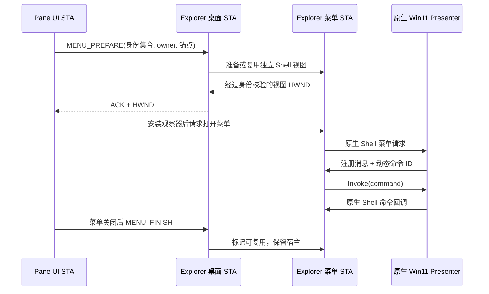

# Win11 独立 Shell 菜单命令路由

本文面向维护 Windows 11 风格项目菜单的开发者，说明独立 Shell 视图、Presenter、命令包装层及应用编辑器之间的协作。该路径依赖系统内部接口，不能保证所有 Windows 构建兼容。

用户入口与开关见[使用说明](usage.md#windows-11-风格右键菜单)，改名提交和文件操作见[图标菜单与重命名](development/pane-item-rename.md)。本页聚焦命令如何到达正确接收方，不将窗口出现或菜单关闭当作命令成功的证明。

## 路由原则

独立 Shell 视图需将注册消息 `FILE_EXPLORER_CONTEXTMENU_INVOKEMENUITEM` 转发到菜单 Presenter 的 `Invoke`。消息编号及命令编号由当前运行环境确定，不能硬编码数值。窗口命中只说明输入到达，不代表 Shell 命令已执行；验证时同时检查命令路由与最终操作结果。

## 视图与线程分工

Pane 保留现有图标绘制、布局、选择和编辑器。真实桌面持续过滤 Pane 中的项目。菜单使用另一份包含选中项目的原生 Shell 视图，两份视图不共享选择状态；既不临时恢复桌面成员，也不复制真实桌面 ListView。



## 实现入口

| 位置 | 职责 |
| --- | --- |
| `app/src/pane/window/mod.rs` | 捕获完整选中集合；释放模型借用后打开菜单；接收重命名结果；键盘菜单锚定选中图标 |
| `crates/luciddesk-shell/src/native_menu.rs` | 前台授权、菜单观察器、关闭后有条件返回 Pane 焦点 |
| `crates/luciddesk-explorer/src/filter/engine.rs` | 验证 owner 所属进程，管理准备/结束协议，菜单错误不撤销桌面过滤 |
| `crates/luciddesk-explorer/src/filter/menu/worker.rs` | 常驻独立 STA，序列化准备、结束与消息派发；超时取消过期准备请求 |
| `crates/luciddesk-explorer/src/filter/menu.rs` | 原生结果视图、选中身份校验、视图命令消息转发及统一菜单请求 |
| `crates/luciddesk-explorer/src/filter/menu/presenter.rs` | 封装私有 COM 接口，处理注册消息对应的 Invoke，保留回调生命周期 |
| `crates/luciddesk-explorer/src/filter/menu/commands.rs` | 包装本次 IContextMenu，记录动态编号起点，查询标准动词并转发普通命令 |
| `crates/luciddesk-explorer/src/filter/menu/callback.rs` | 保留原生 Shell 回调；将 rename 转回 Pane，其他命令继续交给原生回调 |

## 宿主复用与生命周期

- 每个过滤会话持有一个菜单 STA。`MENU_FINISH` 释放本次菜单使用权，不立即销毁 STA 和 Shell 视图。
- 同一 owner、同一有序目标集合可复用，但每次都重新解析目标并比较视图中完整的 Shell 身份集合，再恢复选中项和弹出锚点。删除、改名或集合不匹配不能复用旧目标。
- 目标改变时创建新的已验证视图。旧宿主若仍拥有可见命令窗口（例如属性），先保留，待窗口关闭后在菜单 STA 上释放。
- 属性窗口仍打开时，不复用它的宿主打开下一份菜单，避免禁用 owner 或模态状态影响输入。
- 控制进程退出、过滤会话断开时，worker 请求通道断开，宿主和 COM 对象在其创建线程清理；不停止或重启 Explorer。
- 生产宿主使用空窗口区域提供焦点与 Shell 上下文，本身不绘制文件内容。项目已有 `LUCIDDESK_INSPECT` 测试入口只改变窗口的可检查样式，菜单宿主仍保持空区域。

## 命令识别与执行边界

- 菜单 HWND 的正常命中只是输入到达窗口的证据，不能替代命令消息和最终功能结果。
- 菜单先关闭、再执行命令是异步链路。观察器等待关闭稳定后才结束请求，不把 XAML 的零尺寸初始化窗口当作已显示菜单。
- 属性或其他应用获得前台时不抢回 Pane 焦点。只有前台仍是菜单宿主时才返回 Pane。
- Pane 图标继续自绘，改名输入仍由既有 `RenameItem` 处理。菜单通过 `IContextMenuSite::DoContextMenuPopup` 打开；包装的 `IContextMenu` 记录本次 `QueryContextMenu` 的编号起点，回调以 `command - first` 查询 `GetCommandString(GCS_VERBW)`。仅标准 `rename` 动词转换为 Pane 重命名结果，其他命令继续交给原生 Shell 回调。
- 重命名主路径在开始隐藏编辑前拦截标准动词；`LVN_BEGINLABELEDIT` 只作为兼容补充，不作为编辑器启动的必要条件。
- 识别重命名后先结束原生视图的菜单会话，再通知 Pane。初始化失败或编号范围无效时不猜测命令编号；每次打开重新记录范围，准备失败清除旧范围。
- 不把菜单错误视为桌面过滤失败；准备失败和命令结束各自清理状态，保留真实桌面的过滤成员。
- 冷启动和第三方扩展加载仍有成本；复用减少重复初始化，不等于已经量化消除了所有忙碌指针或扩展加载时间。

### 消息与命令的职责

| 入口 | 处理规则 |
| --- | --- |
| `menu_messages` | 为本次回调持有 Rc 引用，优先把 Presenter 注册消息交给该视图的 Presenter |
| `NativePresenter::handle_command_message` | 只处理匹配的运行时消息；已关闭或已取消时不执行 Invoke |
| `QueryContextMenu` | 先清除旧编号起点，成功后记录本次 `first`；失败不沿用上次范围 |
| 标准 `rename` 动词 | 转为 Pane 重命名结果，避免在隐藏 Shell 视图中启动用户不可见的编辑器 |
| 其他命令 | 保留原生 Shell 回调、命令参数与服务上下文 |
| `LVN_BEGINLABELEDIT` | 兼容补充，阻止独立视图内编辑并转交应用；不是主路径的前置条件 |

命令 ID 属于本次菜单上下文，不能跨菜单缓存。`GetCommandString` 使用相对编号，不应根据菜单文字、语言或固定数字推测重命名。消息处理期间保留 COM/Rc 引用，以应对命令触发关闭、模态窗口或其他重入。

## 提交改名后的身份交接

`rename_shell_item` 使用公开的 `IFileOperationProgressSink::PostRenameItem` 获取 Shell 返回的新项目。托管桌面项目由 `hybrid/rename_transaction.rs` 提交：

1. `UPDATE_BEGIN` 暂停桌面绘制并保持成员过滤。
2. Shell 完成改名后，更新 Pane、图像键和持久化身份，保留分组位置。
3. `REPLACE_IDENTITY` 交接新 PIDL、过滤名字和恢复坐标，发布完整成员集合。
4. `UPDATE_END` 释放事务；失败时仍尝试补偿发布和释放，待保存的工作区由后续同步重试。

更新期间暂停后台清单接收。审计版本包含稳定 ID 和解析名，拒绝改名前发出的结果；文件 ID 不变也不能接收旧路径。晚到的插入通知在桌面下一次绘制前重新过滤。失败、取消及控制进程退出均需要解除绘制暂停。

## 输入来源与 COM 接口

Pane 将鼠标或键盘来源传给菜单。Presenter 适配层在 `DoContextMenu` 及可选 `IContextMenuPresenterTipTest` 显示入口设置鼠标来源位 `0x8`；键盘来源清除此位，其他标记与显式访问键命令透传。

适配层通过 `QueryInterface(IContextMenuPresenter)` 获取准确接口指针，不能把规范 IUnknown 指针按 Presenter 函数表调用。它只暴露自身实现的 IUnknown、Presenter 和可选 TipTest，并保持统一 COM 身份；宿主持有原生 IClosable 用于关闭。Shell 视图回调继续提供其原有服务查询。

`IContextMenu` 包装层同时转发 `IObjectWithSite::SetSite` 与 `GetSite`，保留 Shell 宿主上下文，包括空值清理和错误传播；打开方式等子命令依赖这一上下文。

## 光标与等待

激活独立视图、获取选择菜单、转发 `QueryContextMenu` 及弹出调用返回时检查光标。只有当前菜单 STA 拥有前台 `LucidDesk.IsolatedShellHost.v1`，且光标为 `IDC_WAIT` 或 `IDC_APPSTARTING` 时，才恢复 `IDC_ARROW`。不修改其他前台窗口或全局系统光标。

菜单等待使用有超时的消息唤醒；持有桌面状态借用期间只处理同步发送消息，不派发已投递的过滤修改请求。宿主复用不能消除原生菜单和第三方扩展的加载成本。

## 异常路径与清理

- 客户端先发布带 BEGIN 序号的 `UpdateRelease` 标记，再请求 END；Explorer 定时器可以独立确认 `UpdateReleased`。未确认释放前不开始新事务，旧序号不能释放后续事务。
- `MENU_CANCEL` 设置共享取消标记，菜单线程在显示和命令调用前检查，并关闭 Presenter；取消过的宿主不能复用。扩展阻塞时不强杀 Explorer 线程，返回后继续收尾。
- 整体过滤连接故障时可能短暂恢复桌面，不能承诺所有异常路径都无闪现。

### 正常结束与取消不是同一操作

`Worker::finish(false)` 仅排队发送正常结束请求，不等待 Shell STA 完全空闲；属性窗口可能仍持有模态循环。正常结束不是“所有命令窗口已经销毁”的确认。

取消先设置当前调用的共享取消标记，再请求菜单 STA 关闭 Presenter 并等待结果。当前等待上限为 2 秒，超时仍保留取消标记，阻止扩展返回后继续显示菜单或执行迟到命令。这个超时不是强制终止扩展的期限，也不保证阻塞立即解除。

桌面冻结事务与菜单会话具有各自的释放协议，不应因菜单已关闭便跳过 `UPDATE_END`，也不应因菜单失败撤销正常的成员过滤。完整过滤恢复规则见[原生桌面与成员过滤](development/hybrid-desktop.md)。

## 普通菜单回退外观

私有 Presenter 创建、初始化或服务安装失败时，同一验证后的 Shell 选择集通过公开 `IContextMenu` 和 `TrackPopupMenuEx` 打开菜单，保留动态消息和 Pane 重命名转发。

原生 HMENU 复用文件夹面板的系统明暗主题与 DPI 留白。每次弹出重新读取主题，高对比度沿用系统绘制；关闭后释放窗口钩子并恢复 Explorer 的主题偏好。Shell 扩展负责自己的项目、分隔线和子菜单。

## 验证入口

先按[构建与验证](development/build.md)准备环境。命令包装和输入适配测试可分别检查动态编号、上下文与取消行为：

```powershell
cargo test -p luciddesk-explorer --lib filter::menu::commands::tests --locked --offline -- --test-threads=1
cargo test -p luciddesk-explorer --lib reused_presenter_preserves_source_and_arguments_on_both_native_paths --locked --offline -- --test-threads=1
cargo test -p luciddesk-explorer --lib cancelled_extension_completion_cannot_show_either_popup_path --locked --offline -- --test-threads=1
cargo test -p luciddesk-explorer --lib modal_worker_does_not_block_normal_finish_and_cancel_propagates_close_failure --locked --offline -- --test-threads=1
```

原生 Presenter 接口检查单独运行，测试默认忽略：

```powershell
cargo test -p luciddesk-explorer --lib native_presenter_uses_queried_interface_instead_of_unknown_identity --locked --offline -- --ignored --test-threads=1 --nocapture
```

确认过滤器实际命中测试。模拟 COM 对象可验证参数和引用规则，不能替代 Explorer 内的原生接口验证。

### 实机检查矩阵

| 场景 | 检查结果 |
| --- | --- |
| 鼠标与键盘打开 | 正确锚点和选中集合，输入来源标记不因宿主复用混淆 |
| 重命名确认、取消与输入法组词 | Pane 编辑器正常工作，真实文件及持久化身份与最终操作一致 |
| 打开方式和普通文件命令 | 子菜单可用，命令实际执行，宿主上下文保留 |
| 属性窗口打开后再次调用菜单 | 新菜单不复用仍持有命令窗口的宿主，属性窗口保持可操作 |
| 取消后扩展迟到返回 | 不重新弹出，不执行取消后的命令 |
| 私有能力不可用或关闭精简菜单 | 公共菜单可用，原生动词和重命名转发仍正确 |
| 控制端退出或连接断开 | 宿主按线程归属收尾，桌面过滤与绘制暂停最终释放 |

报告中记录 Windows 构建号、输入方式、目标类型、第三方扩展、菜单样式与最终操作结果。日志中的窗口命中、Invoke 调用或关闭事件分别是中间证据，不能单独证明操作成功；冷启动成本与复用性能也需实际测量。适用平台和验收边界见[验证与兼容边界](development/validation.md)。
